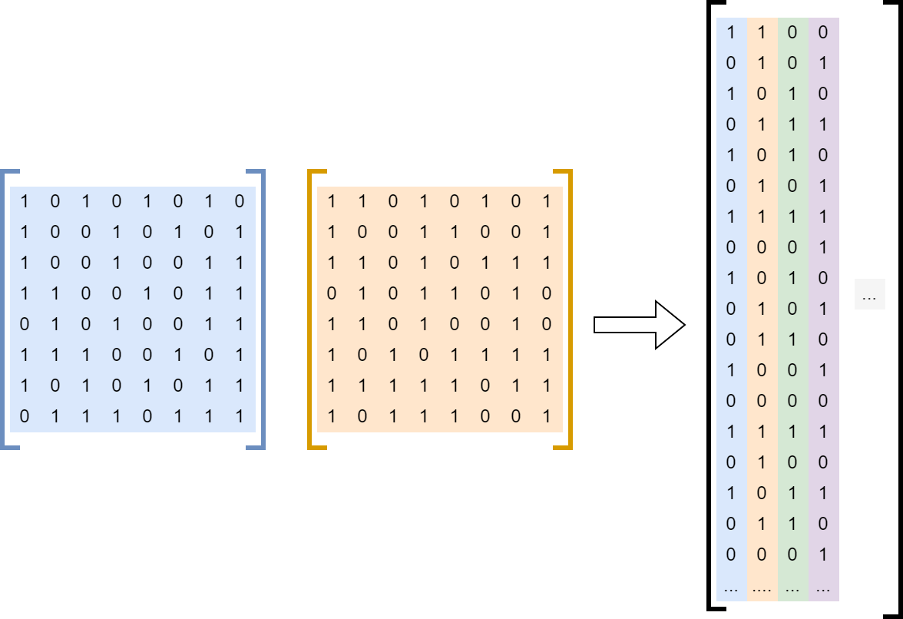
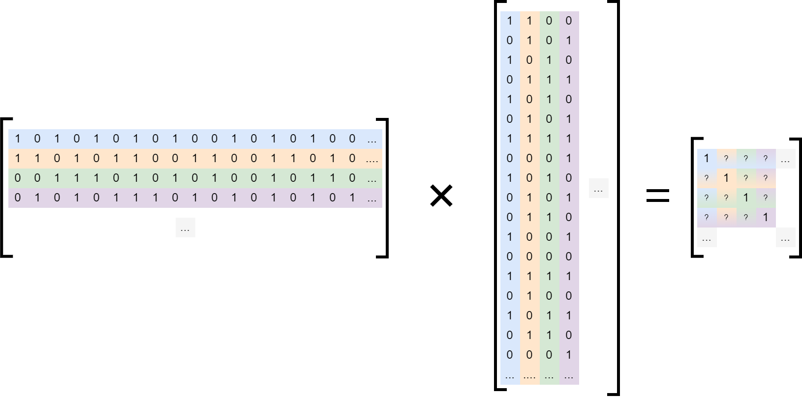

# Fast ComICS

Fast Comprehensive Image Clustering by Similarity (Fast ComICS) is a method
to determine which images are similar to one another and combining them into
a cluster.

```
Similarity (confusion) matrix := ![ A'*A + !(A') * !(A) ]
```





| Method                  | Duration w/ 64-bit hashes | Duration w/ 1024-bit hashes |
| ----------------------- | ------------------------- | --------------------------- |
| Conventional            | ~36s                      | ~40s                        |
| Conventional, Parallel  | n/a *                     | n/a *                       |
| FastCOMICs              | ~2s                       | ~48s **                     |
| FastCOMICs, GPU         | ~4s                       | ~3s                         |

> \* Note: running the comparison of hashes in parallel seems to cause more overhead
> for spawning the threads than time being saved. Therefore, this approach was often
> way slower than simple, nested for-loops.

> \*\* Running the matrix computation with 1024-bit hashes on the CPU seems to blow
> some cache capacity resulting in increased computation time.

# Requirements
 - Python
   - [ImageHash](https://github.com/JohannesBuchner/imagehash)
   - [NumPy](https://numpy.org/)
   - [matplotlib](https://matplotlib.org/)
   - [NVIDIA Container Toolkit](https://docs.nvidia.com/datacenter/cloud-native/container-toolkit/latest/install-guide.html#installing-with-apt)


# Dataset
The dataset provides collections of two hash lengths (64bit, 1024bit) containing the following:

 - The original image's hashes
 - Randomized augmentation of original
 - Noisy augmentation of original

The pickle file contains following forensic image hashes:

 - average
 - perceptual
 - difference
 - wavelet
 - color
 - crop-resistant

Naming scheme of pickle files:

```
<image-id>-<variant: {o,n,r}>-<variation-id>.pkl
```

 - `image-id`: id of the original image
 - `variant`:
   - `o`: original
   - `n`: noisy
     - salt and peper: `amount=0.02`
     - gaussian noise: `mean=0.15`
     - random rotation: `angle=[-25, 25]/10 deg`
   - `r`: randomized
     - added noise (see `n`)
     - 10 added random words at random location
 - `variant-id`: id of repeated variant


# Quick Start
```
./main.py -i data/prehashed-64/ -o .output -n 11
```

**Note:** Drawing of the clusters is not actually done yet...
